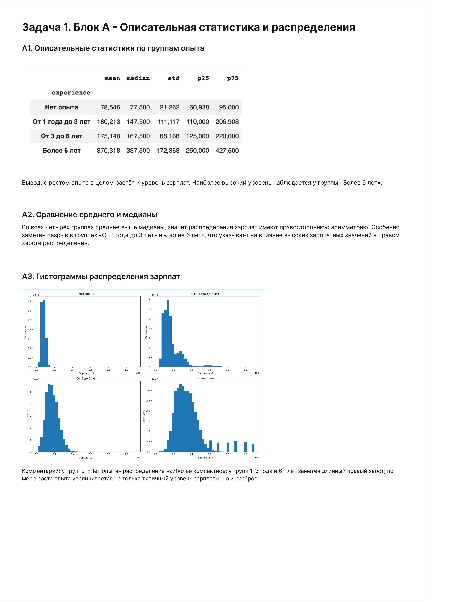
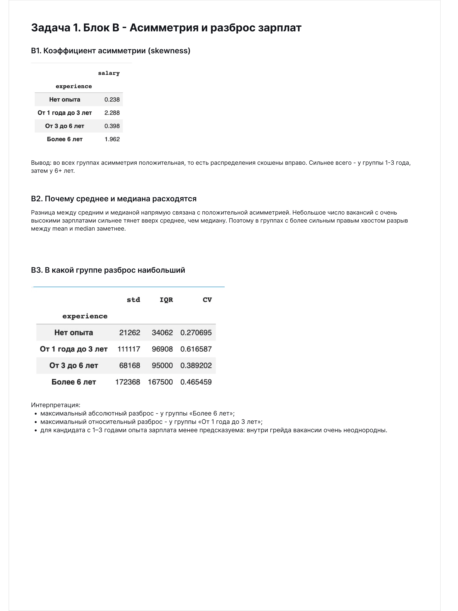
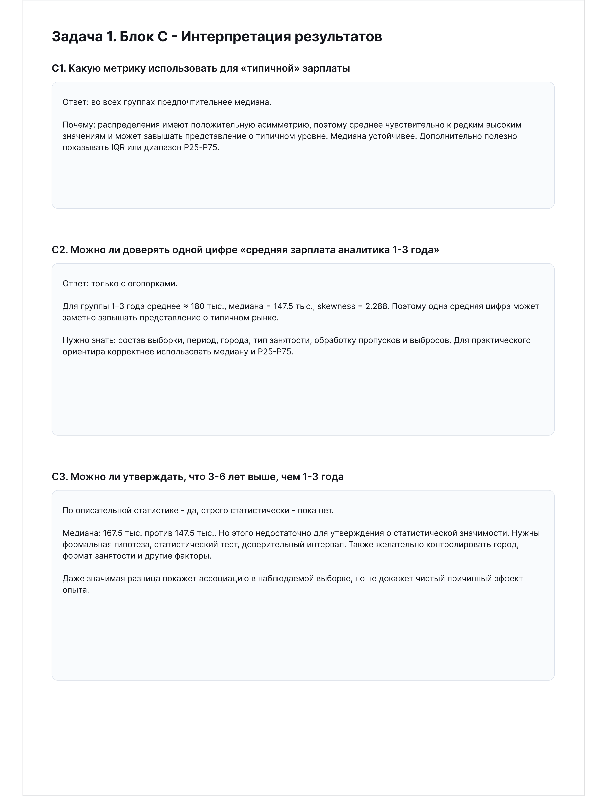
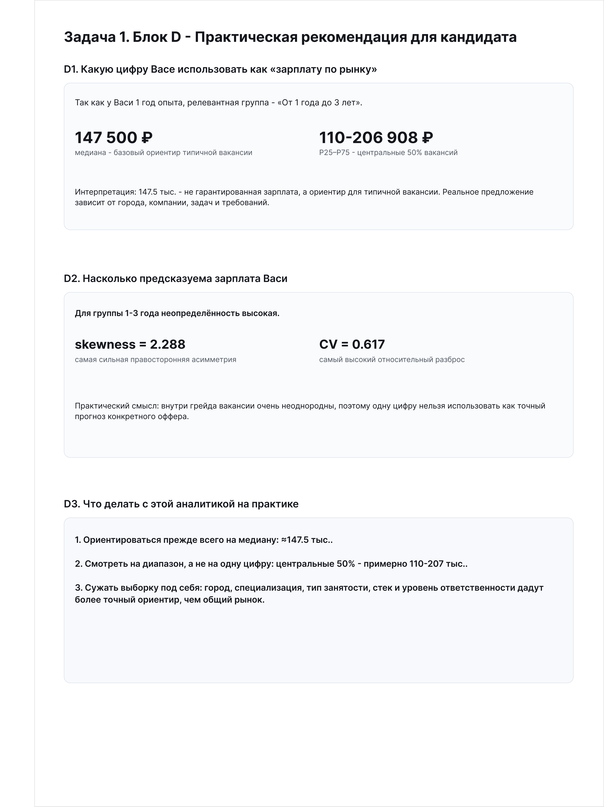
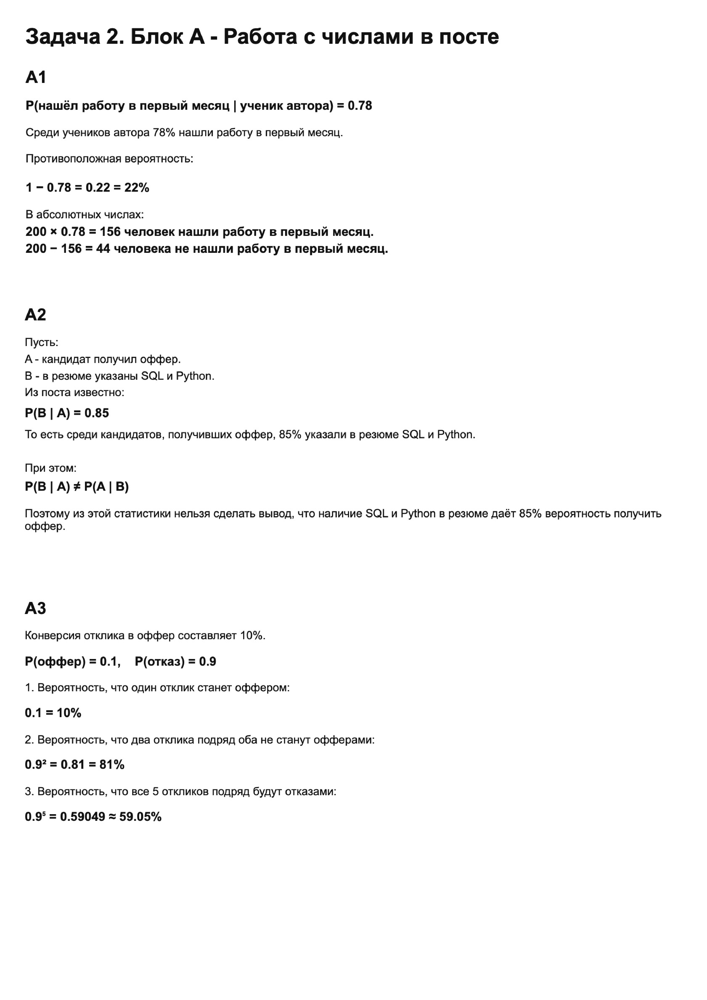
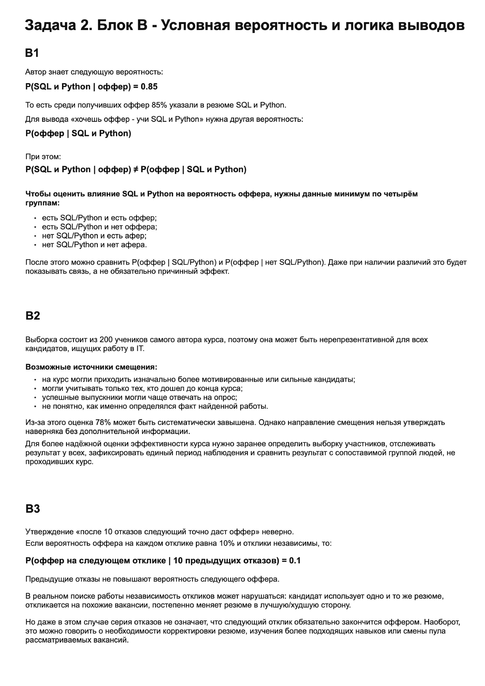
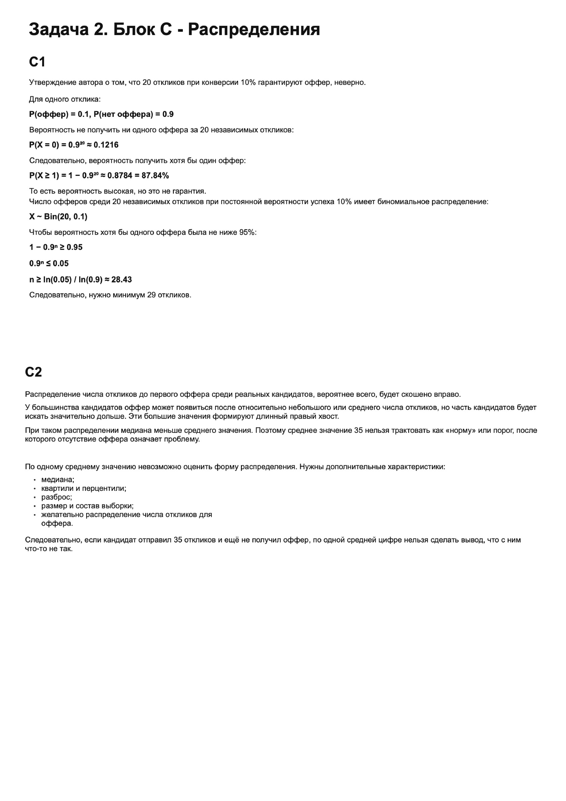
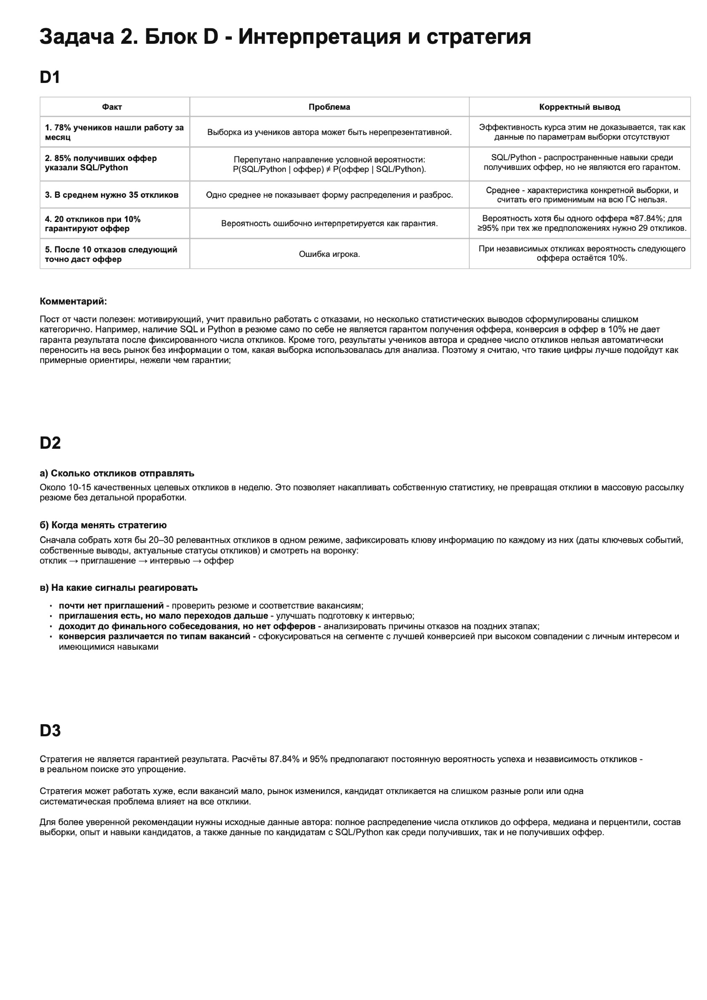

# hh-analytics-case-study
Аналитический кейс: статистический анализ зарплат вакансий

# HH Analytics Case Study

Аналитический кейс, выполненный в рамках отбора в Школу аналитиков hh.ru.

Проект включает две части:
1. анализ зарплатных данных вакансий аналитиков;
2. задачи на статистику, вероятности и интерпретацию результатов.

## Цель проекта

Провести исследование зарплат аналитиков в зависимости от опыта, оценить качество исходных данных, выявить аномалии и сформулировать практические выводы на основе описательной статистики.

## Что было сделано

В рамках анализа:

- проведён первичный EDA;
- исследованы пропуски и некорректные значения;
- проверены аномальные зарплатные вилки;
- рассчитаны mean, median, standard deviation, P25 и P75;
- исследованы skewness, IQR и coefficient of variation;
- построены распределения зарплат по группам опыта;
- сформулированы выводы о типичных зарплатах и разбросе;
- подготовлены практические рекомендации для кандидата;
- отдельно решены задачи на условную вероятность, биномиальное распределение и статистическую интерпретацию.

## Ключевые выводы

- распределения зарплат во всех группах имеют правостороннюю асимметрию;
- для группы с опытом 1–3 года среднее заметно выше медианы, поэтому median лучше отражает типичный уровень зарплаты;
- в группе 1–3 года наблюдается высокий относительный разброс зарплат;
- для оценки рынка одной средней зарплаты недостаточно — необходимо учитывать медиану, P25–P75 и характеристики конкретной вакансии;
- рост опыта связан с ростом типичного уровня зарплаты, но описательной статистики недостаточно для строгих выводов о статистической значимости различий.

## Стек

Python, Pandas, NumPy, Matplotlib, Statistics

## Структура репозитория

```text
hh-analytics-case-study/
├── README.md
├── notebooks/
│   └── salary_analysis.ipynb
├── reports/
│   └── pages/
│       ├── 01_task1_block_a.png
│       ├── 02_task1_block_b.png
│       ├── 03_task1_block_c.png
│       ├── 04_task1_block_d.png
│       ├── 05_task2_block_a.png
│       ├── 06_task2_block_b.png
│       ├── 07_task2_block_c.png
│       └── 08_task2_block_d.png
└── data/
    └── README.md
```

## Ноутбук

Основной анализ находится в:

`notebooks/salary_analysis.ipynb`

## Итоговый отчёт

### Задача 1









### Задача 2









## Данные

Исходный датасет не включён в публичный репозиторий.
